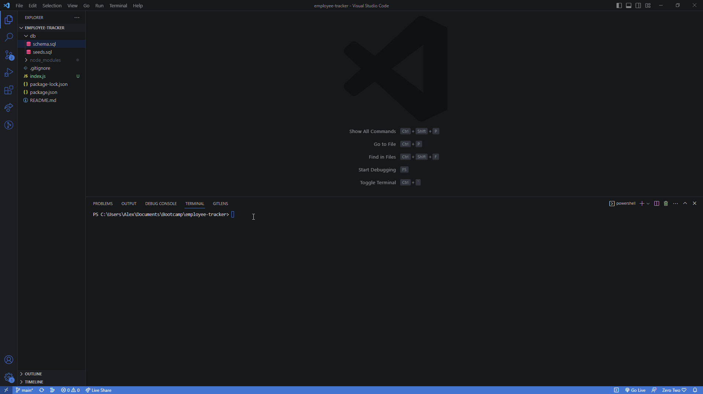
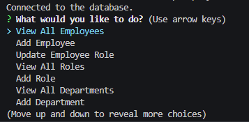

# Employee-Tracker

## Description

An application that uses the terminal to manage a company's employee database. This application uses Node.js, MySQL, and Inquirer.

## Installation

Install NPM packages: 

    npm -i

## Demonstration

## Technologies Used

 * Inquirer

 * mysql

